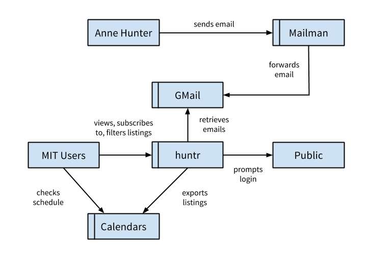
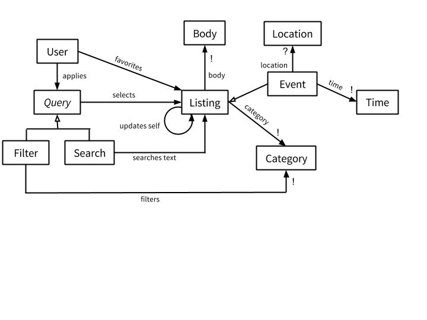

# 6.170 P4 - ys.js
**URL (requires MIT email):** [http://huntr-mit.herokuapp.com](http://huntr-mit.herokuapp.com)

* Yinfu Chen (yinfu)
* Stephen Suen (ssuen)
* Jenny Shen (jenshen)
* Sylvia Zakarian (sylviaz)

## Overview
### Purpose & goals

Huntr aims to organize Anne Hunter's emails into a useful, intuitive graphical interface. Currently, there is no way to view the content of these emails besides sifting through the emails themselves. It can be time consuming to find the information that is important to you and Huntr provides a tool to do that. This app will be accessible to all of MIT and does not require users to be on eecs-jobs-announce.

Goals of Huntr include:

* Sort and display the most pertinent information (e.g., deadlines, category, time/location) from Anne Hunter's emails
* Allow users to curate the listings to their interests
* Let users export listings to their personal calendar systems
* Experiment with building a web interface that integrates emails

### Context diagram

## Concepts
### Key concepts

* An **email** is a message from Anne Hunter.
* A **listing** is a processed email. Listings with a date/time are called **events**.
* A user can **filter** the listings by **category**, which are chosen from predetermined categories including events, external opportunities, and campus opportunities.
* A user can **search** the text of the listings for a desired string.
* A user can **favorite** listings of interest for easy access.

### Data model

## Behavior
### Feature descriptions

* **Up-to-date feed.** Huntr takes Anne Hunter’s emails and displays them in a simple stream of listings that highlight the most important information.
* **Favorite listings.** Huntr allows you to favorite listings you’re interested in, so you can identify them more easily.
* **Calendar export.** Huntr lets you export interesting listings such as events for your organizational systems such as Google Calendar, iCal, and Outlook.
* **Filter and search.** Huntr allows you to find the listings you’re interested in, based on predetermined categories or simple text search.

### Security concerns

#### Security Requirements
* Only users with MIT email addresses are provided access to Huntr.  This limits Huntr’s data to users who would otherwise have access to Anne Hunter’s emails (MIT community).
* Users must be logged in to view listings.
* Users cannot view other users' favorites.
* No exposure of sensitive information. Huntr stores no personal information from users besides email addresses, which are publicly searchable via MIT people search.

#### Threat Model
* Hackers will most likely attack our system purely for fun (pranks)
  * Huntr does not store any private personal information, so assume no interest from state actors or criminal syndicates.
  * Pranks may include changing other people’s favorites, signing someone else up for Huntr, or spoofing Anne Hunter’s emails.
  * Rails has_secure_password will protect user login information.
* Hackers may be non-MIT people who want access to Anne Hunter’s emails
  * MIT users already have access to Anne Hunter’s mailing list and therefore have no access-related incentive to attack Huntr.
  * No threat to users’ information or Huntr’s operation.
* Hackers may take control of the email account from which Huntr processes emails
  * Most problematic issue as it presents a huge threat to Huntr’s operation.

#### Risks and Mitigations
* **Users sign up with fake Kerberos or email addresses that do not belong to them**  
  → Use email verification to ensure that they are owners of those addresses. If someone else’s address is used to sign up, the verifying email will contain a link that allows the recipient to indicate that they did not intend to sign up for the service.  In this case, the email address will be blacklisted from registering for 24 hours, thus deterring trolls and other malicious users.
  
* **Email server crashes, so Huntr cannot fetch emails to process**  
  → Retroactively update the database after a crash. Huntr does this by utilizing the “recent:” gmail prefix, which shows all of Huntr’s email from the past thirty days regardless of whether or not it’s been sent to a POP client already. Then, Huntr checks the email against the listings that have already been processed and creates listings for any emails missing from the database.
  
* **Email account that Huntr fetches from is hacked**  
  → We’ll notice if the email is hacked, in which case we’ll create a new account and remove the old account from eecs-jobs-announce. The new account will be used to fetch emails.

### User interface

#### User workflow

#### Page layout

## Challenges
* Displaying listings on feed
  * Problem: Listings need to be displayed in an intuitive yet useful way to maximize information flow from Huntr to users.
  
  * Solutions: Sort by creation, last modified, event time
    * Creation would be more intuitive (email default) but no improvement
    * Last modified would incorporate event updates, but similar to default
    * Event time would highlight soonest event, but difficult for non-events
  * Chosen Solution: last modified
  
    * Anne Hunter will most likely email reminders for events, so the last modified field of a listing will be updated. 

* Categorization
  * Problem: How should listings be categorized? Should each listing have more than one category?
  
  * Solutions: Categorize by sponsor, listing type, time, or location; listing can fit one or multiple categories
    * Categorization by sponsor seems most useful, but difficult. We could use keyword string search to simplify this process.
    * Allowing multiple categories will cater to listings that can belong to multiple groups, but doesn't seem useful since we also have search
  * Chosen Solution: Use machine learning gem nbayes to categorize listings based on input email’s subject line and body.  Each listing will only fit to one category.
  
    * Will manually categorize some emails to train nbayes.
    * Any listing with a “time” will be considered an event (top layer), then we can search for keywords such as “deadline” or “apply” for jobs, and similarly for announcements and updates.
    * There will be an “other” category for listings that do not match any levels in the categorizer.
  * Further challenge - nbayes categorizer currently does not perform well due to lack of training data. The categorizer will improve as more data are collected.

* Querying listings
  * Problem: Queries can be performed on predefined categories or listing metadata or keyword search. How much freedom should the users get? Can users query on conditions?

  * Solutions: Can query by predefined categories, by keyword search, by listing metadata; can perform query on one condition or multiple conditions
    * By predefined categories would be simple but limiting
    * By keyword search seems slightly useless 
    * By metadata is most flexible but lots of processing
    * Combining query conditions might be tricky

  * Chosen Solution: Queries can be filters on predefined categories or searches based on keywords. A filter and a search can be stacked.
    * Category seems to be the only useful metadata info.
    * Keyword search is useful if users want listings from single company.
    * Allowing users to stack queries will give them the maximum flexibility and utility with Huntr.
    
* Search implementation
    * Problem:  We want an out-of-the-box gem for full-text searching on databases.
    
    * Solutions: Use gems such as Sunspot, Textacular
      * Sunspot runs on Solr and can be used on sqlite databases. Using Solr on Heroku costs money, though, which would be inconvenient in maintaining the service in the future.
      * Textacular runs on postgres databases, so we would have to migrate our database to postgres.
    * Chosen Solution: Use Textacular.
    
      * It’s a pretty powerful gem for full-text searching.
      * Migrating to Postgres was a pain but it’s supposed to be faster than sqlite. Also, there will be fewer problems down the line once we deploy to Heroku.
