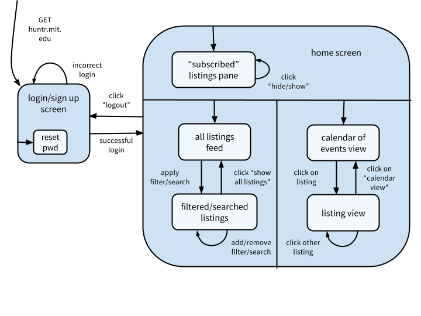
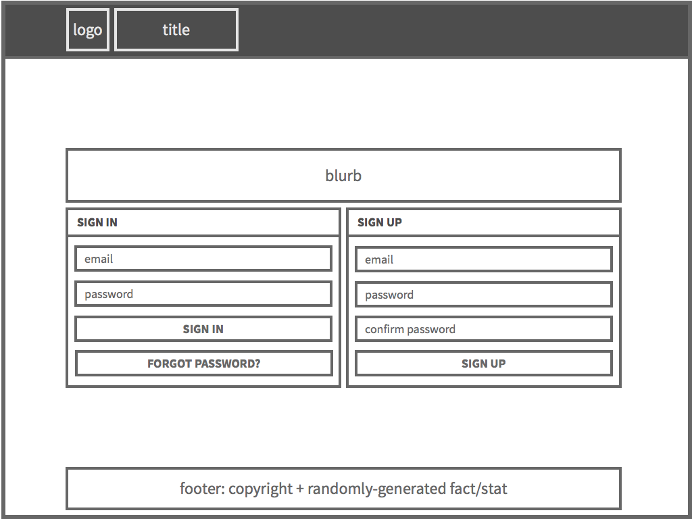
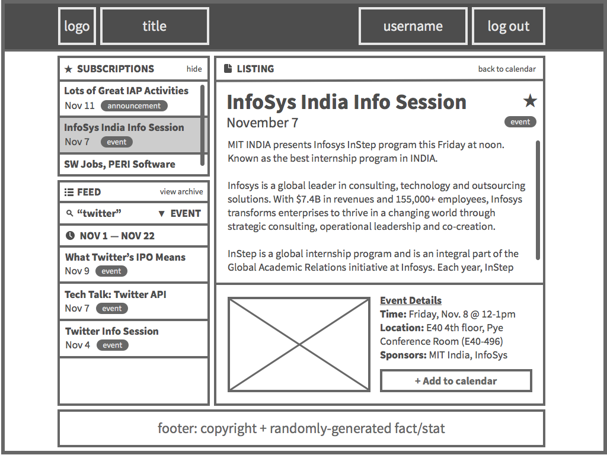

# Design
## Overview
### Purpose & goals

Huntr aims to organize Anne Hunter's emails into a useful, intuitive graphical interface. Currently, there is no way to view the content of these emails besides sifting through the emails themselves.  It can be time consuming to find the information that is important to you and Huntr provides a tool to do that.  This app will be accessible to all of MIT and does not require users to be on eecs-jobs-announce.

Goals of Huntr include:

* Sort and display most pertinent information from Anne Hunter's emails
* Allow users to personalize the listings that are most important to them
* Hook into users’ personal calendars

### Context diagram

## Concepts
### Key concepts

* An **email** is a message from Anne Hunter.
* A **listing** is a processed email. Listings with a date/time are called **events**, and listings become **archived** after a predetermined period of time.
* A user can *filter* the listings by pre-determined categories.
* A user can *search* the listings for any desired string.
* A *subscription* allows a user to save listings of interest.

### Data model

## Behavior
### Feature descriptions

* **Up-to-date feed.** Huntr takes Anne Hunter’s emails and displays them in a simple stream of listings that highlight the most important information.
* **Listing subscriptions.** Huntr allows you to subscribe to listings you’re interested in, and notifies you whenever updates are made to them.
* **Calendar export.** Huntr lets you export interesting listings as events for your organizational systems such as Google Calendar.
* **Filter and search.** Huntr allows you to find the listings you’re interested in, based on predetermined categories or simple text search.

### Security concerns

To use Huntr, you must register with an @mit.edu address.  This limits the app’s users to people who would otherwise have access to Anne Hunter’s mailing list, i.e. the MIT community.  Besides email addresses (which are publicly accessible via MIT people search anyway), Huntr does not request or store any personal information from its users and thus bear no risk of exposing sensitive information.

To circumvent the risk of users signing up with fake kerberos or @mit.edu addresses that do not belong to them, we will use email verification to ensure that they are indeed the owners of those addresses.  Furthermore, if someone else’s address is used to sign up, this verifying email will contain a link that allows the recipient to indicate that they did not intend to sign up for the service.  In this case, the email address will be blacklisted from registering for 24 hours, thus deterring trolls and other malicious users.

### User interface

#### User workflow

#### Page layout

## Challenges

* Displaying listings on feed
  * Problem: listings need to be displayed in an intuitive yet useful way to maximize information flow from Huntr to users.
  * Options: creation, last modified, event time
    * Creation would be more intuitive (email default) but no improvement
    * Last modified would incorporate event updates, but similar to default
    * Event time would highlight soonest event, but difficult for non-events
  * Solution: last modified
    * Anne Hunter will most likely email reminders for events, so the last modified field of a listing will be updated.

* Categorization
  * Problem: how should listings be categorized? Should each listing have more than one category?
  * Options: categorize by sponsor, listing type, time, location; one or multiple categories
    * Categorization by sponsor seems most useful, but difficult. We could use keyword string search to simplify this process.
    * Multiple categories don’t seem useful since we also have filter/search
  * Solution: hierarchical categorizer outputs single category or “other” based on listing type
    * Any listing with a “time” will be considered an event (top layer), then we can search for keywords such as “deadline” or “apply” for jobs, and similarly for announcements and updates.
    * There will be an “other” category for listings that do not match any levels in the categorizer

* Querying listings
  * Problem: queries can be based on predefined categories or listing metadata or keyword search. How much freedom should the users get?  Can users query on multiple filters?
  * Options: query by predefined categories, keyword search, listing metadata; single vs multiple filters?
    * By predefined categories would be simple but limiting
    * By keyword search seems slightly useless 
    * By metadata is most flexible but lots of processing
    * Combining queries might be tricky
  * Solution: queries can be filters on predefined categories or search on a keyword. Filters and Searches can be stacked
    * Category seems to be the only useful metadata info
    * Keyword search is useful if users want listings from single company
    * Allowing users to stack queries will give them the maximum flexibility and utility with Huntr.

